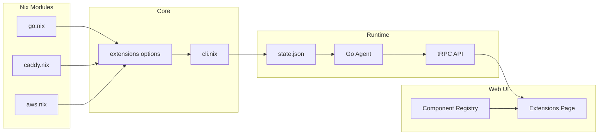

# Extension Panels System

This plan adds a panels system to stack extensions, allowing Nix modules to define UI components that render in the web interface.

## Architecture Overview



## Key Files to Modify/Create

| File | Action | Purpose |

|------|--------|---------|

| [`nix/stack/db/schemas/extensions.proto.nix`](nix/stack/db/schemas/extensions.proto.nix) | Modify | Add `ExtensionPanel` message and `PanelType` enum |

| [`nix/stack/core/options/extensions.nix`](nix/stack/core/options/extensions.nix) | Create | Define `stack.extensions` options from proto |

| [`nix/stack/core/cli.nix`](nix/stack/core/cli.nix) | Modify | Include extensions in `fullConfig` JSON |

| [`packages/proto/proto/extensions.proto`](packages/proto/proto/extensions.proto) | Regenerate | Run proto codegen |

| `apps/web/src/lib/extension-components.tsx` | Create | Component registry for panels |

| `apps/web/src/routes/_app/extensions.tsx` | Create | Extensions page with panel rendering |

## Implementation Details

### 1. Proto Schema Changes

Add to [`extensions.proto.nix`](nix/stack/db/schemas/extensions.proto.nix):

```nix
enums = {
  # existing SourceType...
  
  PanelType = proto.mkEnum {
    name = "PanelType";
    description = "Type of extension panel";
    values = [
      "PANEL_TYPE_UNSPECIFIED"
      "PANEL_TYPE_FORM"      # Configuration forms
      "PANEL_TYPE_STATUS"    # Status/metrics widgets
    ];
  };
};

messages = {
  # Add new ExtensionPanel message
  ExtensionPanel = proto.mkMessage {
    name = "ExtensionPanel";
    description = "A UI panel provided by an extension";
    fields = {
      id = proto.string 1 "Unique panel identifier";
      title = proto.string 2 "Display title";
      description = proto.optional (proto.string 3 "Panel description");
      type = proto.message "PanelType" 4 "Panel type";
      component = proto.string 5 "Component name from registry";
      order = proto.int32 6 "Display order (lower = first)";
      config = proto.map "string" "string" 7 "Component-specific config";
    };
  };
  
  # Modify Extension to include panels
  Extension = proto.mkMessage {
    # ...existing fields...
    panels = proto.repeated (proto.message "ExtensionPanel" 8 "UI panels");
  };
};
```

### 2. Nix Options Module

Create `nix/stack/core/options/extensions.nix`:

- Define `options.stack.extensions` as attrsOf submodule
- Derive options from proto schema using `db.extend.extension`
- Allow modules to register via `stack.extensions.<name>`

### 3. Module Registration Pattern

Existing modules (e.g., `go.nix`) can register panels:

```nix
config.stack.extensions.go = lib.mkIf hasGoApps {
  name = "Go";
  enabled = true;
  panels = [
    {
      id = "go-apps";
      title = "Go Applications";
      type = "status";
      component = "apps-grid";
      config.filter = "go.enable";
    }
  ];
};
```

### 4. CLI State Integration

Modify [`cli.nix`](nix/stack/core/cli.nix) to include extensions in `fullConfig`:

```nix
fullConfig = {
  # ...existing...
  extensions = lib.mapAttrs (name: ext: {
    inherit (ext) name enabled panels;
    # other serializable fields
  }) (lib.filterAttrs (_: e: e.enabled) cfg.extensions);
};
```

### 5. Web Component Registry

Create a registry mapping component names to React components:

- `apps-grid`: Grid of apps with status indicators
- `service-status`: Service health/metrics
- `config-form`: JSON-schema driven settings form
- `log-viewer`: Real-time log display

### 6. Extensions Page

Render panels by:

1. Fetching extensions from agent API
2. Grouping panels by extension
3. Looking up component in registry
4. Rendering with panel config as props

## Migration Notes

- Existing extensions schema remains backward compatible (panels is optional/repeated)
- Proto regeneration required after schema changes
- Component registry is extensible for future panel types
