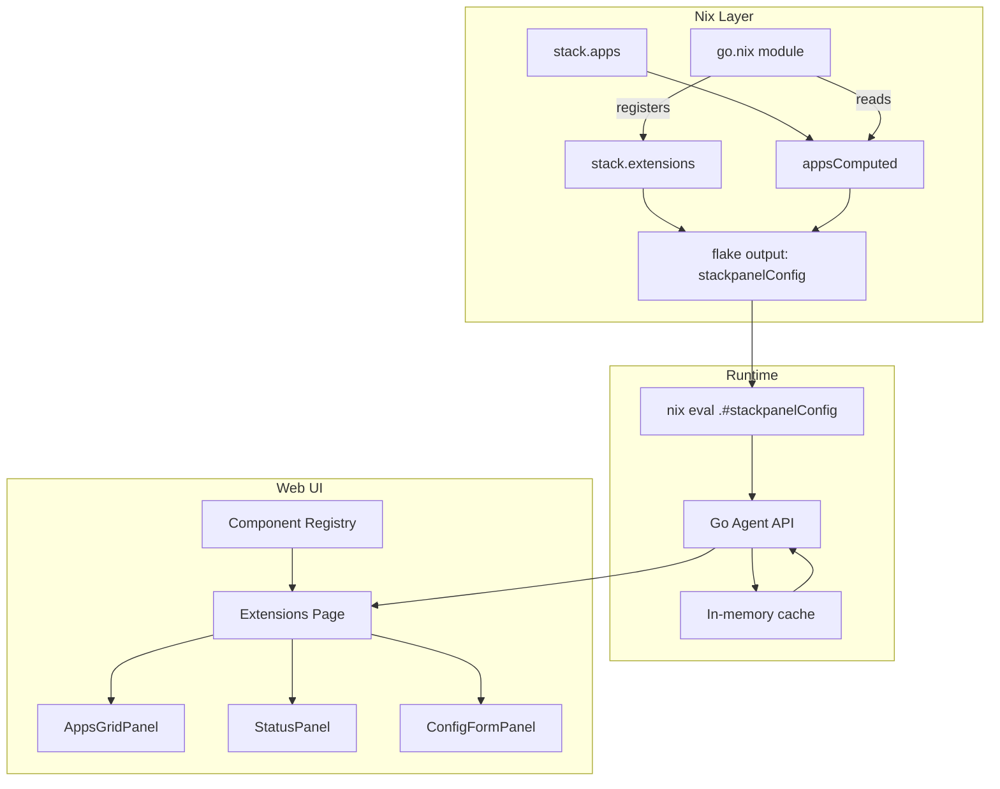

# Extension Panels System (v2)

Adds a panels system where Nix modules define UI components with typed configuration. Extensions access computed app data and the web UI renders panels via a component registry.

## Data Flow Architecture (nix eval, no state.json)

The agent evaluates Nix live via `nix eval --impure --json .#stackpanelConfig`, eliminating state drift. Extensions and their computed app data are part of this evaluation.



**Key points:**

- No `state.json` in the data flow - agent uses `nix eval` directly
- Agent caches results in memory (with SSE invalidation on file changes)
- Extensions include computed per-app data at eval time

## 1. Proto Schema: Panel Field Types

Add to [`extensions.proto.nix`](nix/stack/db/schemas/extensions.proto.nix):

```nix
enums = {
  PanelType = proto.mkEnum {
    name = "PanelType";
    values = [ "PANEL_TYPE_UNSPECIFIED" "PANEL_TYPE_APPS_GRID" "PANEL_TYPE_STATUS" "PANEL_TYPE_FORM" ];
  };
  
  FieldType = proto.mkEnum {
    name = "FieldType";
    description = "Field types that map to component props";
    values = [
      "FIELD_TYPE_UNSPECIFIED"
      "FIELD_TYPE_STRING"
      "FIELD_TYPE_NUMBER"
      "FIELD_TYPE_BOOLEAN"
      "FIELD_TYPE_SELECT"      # dropdown with options
      "FIELD_TYPE_MULTISELECT" # multiple selection
      "FIELD_TYPE_APP_FILTER"  # filter expression for apps
      "FIELD_TYPE_COLUMNS"     # column selection for grids
    ];
  };
};

messages = {
  PanelField = proto.mkMessage {
    name = "PanelField";
    description = "A typed field in panel configuration";
    fields = {
      name = proto.string 1 "Field name (maps to component prop)";
      type = proto.message "FieldType" 2 "Field type";
      value = proto.string 3 "Field value (JSON-encoded for complex types)";
      options = proto.repeated (proto.string 4 "Options for select fields");
    };
  };
  
  ExtensionPanel = proto.mkMessage {
    name = "ExtensionPanel";
    fields = {
      id = proto.string 1 "Unique panel identifier";
      title = proto.string 2 "Display title";
      description = proto.optional (proto.string 3 "Panel description");
      type = proto.message "PanelType" 4 "Panel type (determines component)";
      order = proto.int32 5 "Display order";
      fields = proto.repeated (proto.message "PanelField" 6 "Panel configuration fields");
    };
  };
  
  # Per-app extension data (computed values)
  ExtensionAppData = proto.mkMessage {
    name = "ExtensionAppData";
    fields = {
      enabled = proto.bool 1 "Whether extension is enabled for this app";
      config = proto.map "string" "string" 2 "Extension config for this app";
    };
  };
  
  Extension = proto.mkMessage {
    name = "Extension";
    fields = {
      # ...existing fields...
      panels = proto.repeated (proto.message "ExtensionPanel" 8 "UI panels");
      apps = proto.map "string" "ExtensionAppData" 9 "Per-app extension data";
    };
  };
};
```

## 2. Extension Registration with App Data

Modules serialize their computed app data. Example for `go.nix`:

```nix
# In go.nix config section
stack.extensions.go = lib.mkIf (goApps != {}) {
  name = "Go";
  enabled = true;
  
  # Panels define what UI to render
  panels = [
    {
      id = "go-apps-grid";
      title = "Go Applications";
      type = "PANEL_TYPE_APPS_GRID";
      order = 1;
      fields = [
        { name = "filter"; type = "FIELD_TYPE_APP_FILTER"; value = "go.enable"; }
        { name = "columns"; type = "FIELD_TYPE_COLUMNS"; value = ''["name","path","version","status"]''; }
      ];
    }
    {
      id = "go-status";
      title = "Go Environment";
      type = "PANEL_TYPE_STATUS";
      order = 2;
      fields = [
        { name = "metrics"; type = "FIELD_TYPE_STRING"; value = ''[
          {"label": "Go Version", "value": "${pkgs.go.version}"},
          {"label": "Apps", "value": "${toString (lib.length (lib.attrNames goApps))}"}
        ]''; }
      ];
    }
  ];
  
  # Per-app computed data (serializable subset)
  apps = lib.mapAttrs (name: app: {
    enabled = true;
    config = {
      path = app.path;
      version = app.go.version;
      binaryName = app.go.binaryName or name;
      mainPackage = app.go.mainPackage;
    };
  }) goApps;
};
```

## 3. Flake Output for Agent (nix eval)

The agent calls `nix eval --impure --json .#stackpanelConfig` to get live config. We need to ensure extensions are exposed in this output.

### Option A: Add to existing stackpanelConfig

In [`merged-config.nix`](nix/flake/merged-config.nix), the `stackpanelConfig` already includes the full evaluated config. Extensions would be part of `stackpanelEval.config.stack.extensions`.

### Option B: Expose via devShell passthru

The agent also tries `.#devShells.{system}.default.passthru.moduleConfig.stack`. Extensions would be included automatically once the options module exists.

### Serialized JSON structure (from nix eval):

```json
{
  "extensions": {
    "go": {
      "name": "Go",
      "enabled": true,
      "panels": [
        {
          "id": "go-apps-grid",
          "title": "Go Applications",
          "type": "PANEL_TYPE_APPS_GRID",
          "fields": [
            { "name": "filter", "type": "FIELD_TYPE_APP_FILTER", "value": "go.enable" },
            { "name": "columns", "type": "FIELD_TYPE_COLUMNS", "value": "[\"name\",\"path\",\"version\",\"status\"]" }
          ]
        }
      ],
      "apps": {
        "stack-go": {
          "enabled": true,
          "config": {
            "path": "apps/stack-go",
            "version": "0.1.0",
            "binaryName": "stack"
          }
        }
      }
    }
  }
}
```

## 4. React Component Registry

Create `apps/web/src/lib/extension-panels/`:

### Type Definitions (`types.ts`)

```typescript
// Field types from proto
export type FieldType = 
  | 'FIELD_TYPE_STRING'
  | 'FIELD_TYPE_NUMBER'
  | 'FIELD_TYPE_BOOLEAN'
  | 'FIELD_TYPE_SELECT'
  | 'FIELD_TYPE_MULTISELECT'
  | 'FIELD_TYPE_APP_FILTER'
  | 'FIELD_TYPE_COLUMNS';

export type PanelType = 
  | 'PANEL_TYPE_APPS_GRID'
  | 'PANEL_TYPE_STATUS'
  | 'PANEL_TYPE_FORM';

export interface PanelField {
  name: string;
  type: FieldType;
  value: string; // JSON-encoded for complex types
  options?: string[];
}

export interface ExtensionPanel {
  id: string;
  title: string;
  description?: string;
  type: PanelType;
  order: number;
  fields: PanelField[];
}

export interface ExtensionAppData {
  enabled: boolean;
  config: Record<string, string>;
}

export interface Extension {
  name: string;
  enabled: boolean;
  panels: ExtensionPanel[];
  apps: Record<string, ExtensionAppData>; // app name -> extension data
}

// Props derived from fields
export interface AppsGridProps {
  extension: Extension;
  allApps: Record<string, AppData>; // from nix eval config.apps
  filter?: string;
  columns?: string[];
}

export interface StatusPanelProps {
  extension: Extension;
  metrics: Array<{ label: string; value: string | number; status?: 'ok' | 'warning' | 'error' }>;
}

export interface ConfigFormProps {
  extension: Extension;
  schema: JSONSchema7;
  values: Record<string, unknown>;
  onSave: (values: Record<string, unknown>) => Promise<void>;
}
```

### Component Registry (`registry.tsx`)

```typescript
import { AppsGridPanel } from './panels/apps-grid';
import { StatusPanel } from './panels/status';
import { ConfigFormPanel } from './panels/config-form';
import type { PanelType, ExtensionPanel, Extension } from './types';

const componentRegistry: Record<PanelType, React.ComponentType<any>> = {
  PANEL_TYPE_APPS_GRID: AppsGridPanel,
  PANEL_TYPE_STATUS: StatusPanel,
  PANEL_TYPE_FORM: ConfigFormPanel,
};

// Parse fields into typed props
function parseFields(fields: PanelField[]): Record<string, unknown> {
  const props: Record<string, unknown> = {};
  for (const field of fields) {
    switch (field.type) {
      case 'FIELD_TYPE_STRING':
        props[field.name] = field.value;
        break;
      case 'FIELD_TYPE_NUMBER':
        props[field.name] = Number(field.value);
        break;
      case 'FIELD_TYPE_BOOLEAN':
        props[field.name] = field.value === 'true';
        break;
      case 'FIELD_TYPE_COLUMNS':
      case 'FIELD_TYPE_APP_FILTER':
        props[field.name] = JSON.parse(field.value);
        break;
      default:
        props[field.name] = field.value;
    }
  }
  return props;
}

export function renderPanel(panel: ExtensionPanel, extension: Extension, allApps: AppData) {
  const Component = componentRegistry[panel.type];
  if (!Component) return null;
  
  const fieldProps = parseFields(panel.fields);
  
  return (
    <Component
      key={panel.id}
      extension={extension}
      allApps={allApps}
      {...fieldProps}
    />
  );
}
```

### Apps Grid Panel (`panels/apps-grid.tsx`)

```typescript
import { Card, CardHeader, CardTitle, CardContent } from '@/components/ui/card';
import { Badge } from '@/components/ui/badge';
import type { AppsGridProps, ExtensionAppData } from '../types';

export function AppsGridPanel({ extension, allApps, filter, columns = ['name', 'path', 'status'] }: AppsGridProps) {
  // Filter apps that have this extension enabled
  const extensionApps = Object.entries(extension.apps)
    .filter(([_, data]) => data.enabled)
    .map(([appName, extData]) => ({
      name: appName,
      ...allApps[appName], // port, domain, url from base app data
      ...extData.config,   // extension-specific computed values
    }));

  return (
    <Card>
      <CardHeader>
        <CardTitle className="flex items-center gap-2">
          {extension.name} Apps
          <Badge variant="secondary">{extensionApps.length}</Badge>
        </CardTitle>
      </CardHeader>
      <CardContent>
        <div className="grid grid-cols-1 md:grid-cols-2 lg:grid-cols-3 gap-4">
          {extensionApps.map((app) => (
            <div key={app.name} className="p-4 border rounded-lg">
              <h4 className="font-medium">{app.name}</h4>
              <p className="text-sm text-muted-foreground">{app.path}</p>
              {columns.includes('version') && app.version && (
                <Badge variant="outline">v{app.version}</Badge>
              )}
              {columns.includes('port') && app.port && (
                <span className="text-xs">:{app.port}</span>
              )}
            </div>
          ))}
        </div>
      </CardContent>
    </Card>
  );
}
```

### Status Panel (`panels/status.tsx`)

```typescript
import { Card, CardHeader, CardTitle, CardContent } from '@/components/ui/card';
import { CheckCircle, AlertCircle, XCircle } from 'lucide-react';
import type { StatusPanelProps } from '../types';

const statusIcons = {
  ok: CheckCircle,
  warning: AlertCircle,
  error: XCircle,
};

export function StatusPanel({ extension, metrics }: StatusPanelProps) {
  return (
    <Card>
      <CardHeader>
        <CardTitle>{extension.name} Status</CardTitle>
      </CardHeader>
      <CardContent>
        <dl className="grid grid-cols-2 gap-4">
          {metrics.map((metric, i) => {
            const Icon = statusIcons[metric.status || 'ok'];
            return (
              <div key={i} className="flex items-center gap-2">
                <Icon className={`h-4 w-4 ${
                  metric.status === 'error' ? 'text-destructive' :
                  metric.status === 'warning' ? 'text-yellow-500' : 'text-green-500'
                }`} />
                <dt className="text-muted-foreground">{metric.label}:</dt>
                <dd className="font-medium">{metric.value}</dd>
              </div>
            );
          })}
        </dl>
      </CardContent>
    </Card>
  );
}
```

## 5. Extensions Page (`routes/_app/extensions.tsx`)

The page queries the agent's `/api/nix-config` endpoint, which evaluates Nix live:

```typescript
import { useAgentQuery } from '@/lib/agent-provider';
import { renderPanel } from '@/lib/extension-panels/registry';

export function ExtensionsPage() {
  // Agent runs: nix eval --impure --json .#stackpanelConfig
  // Returns { apps, extensions, services, ... }
  const { data: config } = useAgentQuery('nix-config');
  
  if (!config?.extensions) return <EmptyState />;
  
  return (
    <div className="space-y-8">
      {Object.entries(config.extensions).map(([key, extension]) => (
        <section key={key}>
          <h2 className="text-2xl font-bold mb-4">{extension.name}</h2>
          <div className="grid gap-4">
            {extension.panels
              .sort((a, b) => a.order - b.order)
              .map((panel) => renderPanel(panel, extension, config.apps))}
          </div>
        </section>
      ))}
    </div>
  );
}
```

## Files to Create/Modify

| File | Action |

|------|--------|

| `nix/stack/db/schemas/extensions.proto.nix` | Add PanelField, FieldType, ExtensionAppData |

| `nix/stack/core/options/extensions.nix` | Create options module |

| `nix/flake/merged-config.nix` | Verify extensions are in stackpanelConfig output |

| `nix/stack/modules/go.nix` | Add example extension registration |

| `apps/web/src/lib/extension-panels/types.ts` | TypeScript types |

| `apps/web/src/lib/extension-panels/registry.tsx` | Component registry |

| `apps/web/src/lib/extension-panels/panels/*.tsx` | Panel components |

| `apps/web/src/routes/_app/extensions.tsx` | Extensions page |