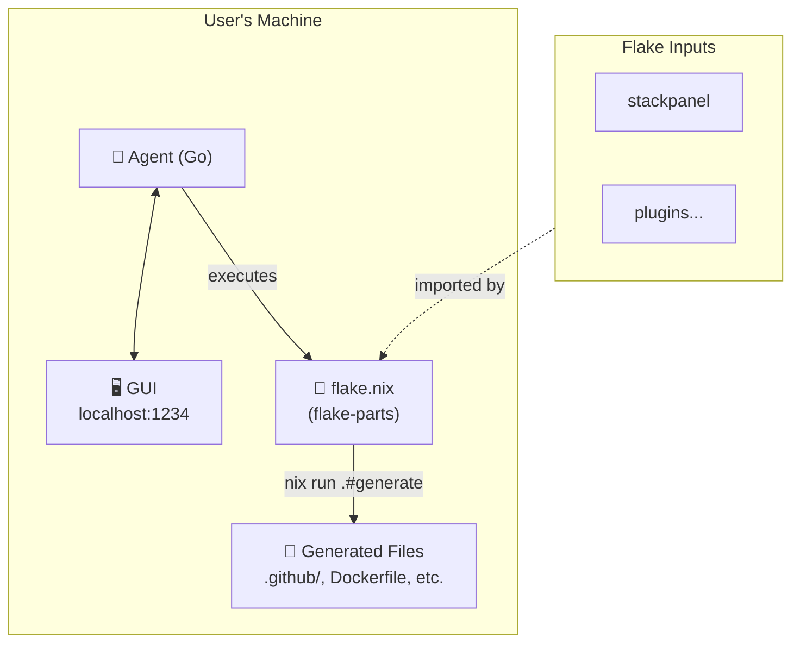

<center>

# 1. stackpanel

Your entire stack in one panel

</center>

## 1.1. Overview

Internal control plane to that lets you go from `localhost:3000` -> production without leaving the page. [^1]

For now, this document describes the architecture and implementation plan.

## 1.2. Goals

- Autogenerate a reproducible dev environment for any project
  - Zero setup for popular stacks
- The default configuration is deliberately opinionated but is easy to change
- Minimal lock-in
- Open source and self-hosted.

## 1.3. Architecture



**Components:**

| Component | Role |
| ------------------- | ----------------------------------------------------------------------------- |
| **Agent** | Go binary serving GUI locally. Executes Nix commands. Works offline. |
| **GUI** | Browser interface to configure stack, trigger builds, view status. |
| **Flake** | Source of truth. flake-parts modules define the entire stack. |
| **Generated Files** | Standard paths (`.github/`, `Dockerfile`). Git-tracked. CI works without Nix. |

**Plugin ecosystem:**

```nix
inputs = {
  stackpanel.url = "github:darkmatter/stackpanel";

  # Community plugins are just flake inputs
  stackpanel-aws.url = "github:someone/stackpanel-aws";
  stackpanel-stripe.url = "github:someone/stackpanel-stripe";
};

imports = [
  inputs.stackpanel.flakeModules.default
  inputs.stackpanel-aws.flakeModules.default
];
```

## 1.4. How it Works

**Nix Foundation**

stackpanel is entirely made possible by Nix which does the heavy lifting. One big reason is that nix ensures all builds start in the same zero state on all machines. Combined with the determinstic build system, we can get reproducible builds.

We are used to this reproducibilty only extending to our Docker containers, so we stop there. We can't involve regular apps in `/Applications`, our system keychain, our network interfaces, and all the other things that are hidden and untouchable by code inside docker without extra steps or workarounds.

**Modules**

Another **key** aspect is the module system of nix flakes. Programs have rules like `package.json` having to be in a specifc place, or blessed files such as `/etc/hosts`, or having to configure multiple files to get something to do what you want.

Nix's builtins and standard libraries make it very easy to do the same things using a single file. And since we can import, we can put these files anywhere we want. This makes it work very well for composing configurations, something that typically has a lot of footguns.

These are the levers we will pull to make this work. Below are more detailed plans for each module.

## 1.5. Codebase

At a high-level, the user's project will look like this:

```
my-project/
├── flake.nix                 # Nix flake entrypoint (uses flake-parts)
├── flake.lock                # Locked dependencies
├── .envrc                    # direnv integration (auto-activates env)
│
├── modules/                  # User's local flake-parts modules
│   ├── default.nix           # Module entrypoint
│   └── ...                   # Custom overrides (optional)
│
├── secrets/                  # Encrypted secrets (agenix)
│   ├── secrets.nix           # Secret declarations
│   └── *.age                 # Encrypted secret files
│
│── # ─── Generated files (checked into git) ───────────────
│
├── .github/                  # Generated: GitHub Actions workflows
│   └── workflows/
│       └── ci.yml
├── Dockerfile                # Generated: Container build
├── docker-compose.yml        # Generated: Local services
├── .tool-versions            # Generated: asdf/mise version pinning
│
│── # ─────────────────────────────────────────────────────
│
├── .stackpanel/              # Agent state (gitignored)
│   └── cache/
│
└── <user-code>/              # User's actual application code
    └── ...
```

**Key insight:** Files like `Dockerfile`, `.github/workflows/`, etc. are _generated_ by Nix but placed in standard locations where tools expect them. They're checked into git for visibility and auditability. The flake overwrites them on regeneration. This reduces lock-in to near zero, since files will be exactly where tools expect them. However, it is still recommended to avoid configuration files entirely and instead bake it into the executable.

```yaml
# ⚠️ Generated by stackpanel - edits will be overwritten
# To customize, modify flake.nix and run: stackpanel generate
```

# 2. Implementation Plan

We'll do the implementation in 2 phases - first we'll get to a point where we can use it internally and dogfood it, then we'll add to it incrementally from there. We need to think about it like we're just making it for ourselves.

Here are the components that we'll need:

- Tailscale - this will create the internal network.
- Any server - this will be exposed to the internal network and run the stackpanel server.
- step - we need the smallstep CLI installed on the server, and that will be the Certificate Authority for our internal network.
- CoreDNS or Caddy: The server also needs to be a DNS server. Installing any of these would make that easy.
- OAuth support - we can probably use a plugin like better-auth and install it onto the internal server. We just need a way to let team members "join" using github.

For the sake of clarity, we will pretend that there's no UI and instead just a CLI, since we can make a CLI command to UI anyways. A really good analogy here is `devenv`. When you run `devenv init`, it creates 3 files:

- devenv.nix
- devenv.yaml
- .envrc

When you "activate" stackpanel on a repo, it's the same. Except it's going to install a `flake.nix` instead, with something like this:

```nix
inputs = {
  stackpanel.url = "github:darkmatter/stackpanel";

  # Community plugins are just flake inputs
  stackpanel-aws.url = "github:someone/stackpanel-aws";
  stackpanel-stripe.url = "github:someone/stackpanel-stripe";
};

imports = [
  inputs.stackpanel.flakeModules.default
  inputs.stackpanel-aws.flakeModules.default
  ./.stackpanel
];
```

And then we'll create another directory that gets checked in named `.stackpanel` where we can put autogenerated nix files. This is our integration point that we'll use when we need to do anything to their repo to make something work.

As an example, let's we wanted to have an "automatic VS-Code integration" feature, so we want to set `terminal.integrated.inheritEnv` to `true`. We can do this:

```nix
{ pkgs, lib, ... }: let
  current-settings = lib.importJSON ".vscode/settings.json";
  our-settings = {
    "terminal.integrated.inheritEnv" = true;
    "python.venvpath" = "${workspaceFolder}/.venv";
  };
  combined-settings = our-settings // user-settings;
in {
  files.".vscode/settings.json" = lib.toJSON combined-settings;
  # other files...
}
```

Or how about if we want to do something more elaborate - like using a different version of go depending on the path of the package being excuted?

```nix

{ pkgs, libs, ...}: {
  # create a go with 2 go's in it
  scripts."go-twin" = {
    description = "go 1.23 or maybe 1.25";
    exec = ''
      #!/usr/bin/env sh
      enable_alt=
      if [ "$(pwd)" =~ "*/apps/otherapp" ]; then
        exec ${pkgs.go1_23}/bin/go "$@"
      else
        exec ${pkgs.go1_25}/bin/go "$A"
      fi
    '';
    packages = [ pkgs.go1_25 pkgs.go1_23 ];
  };

  # add it to vs code - assumes we created a vscode module
  stackpanel.vscode."go.binPath" = "go-twin";
}

```

So in general we'll use the agent to generate configuration nix files into their repo, and we'll implement the core of it as a nix flake which will be used as an input.

Next are the actual plans for each feature which will make this more clear.

## Secrets

The first thing we will start with is secrets. We'll build on top of agenix, so we can install it by adding this to `flake.nix`:

```nix
{
  # other inputs..

  inputs.agenix.url = "github:ryantm/agenix";


  outputs = { self, nixpkgs, agenix, ... }:
  let
    pkgs = import nixpkgs { system = currentSystem; };
  in {
    packages.x86_64-linux.default = agenix.packages.x86_64-linux.default;

    # Optional: devshell
    devShells.x86_64-linux.default = pkgs.mkShell {
      buildInputs = [ agenix.packages.x86_64-linux.default pkgs.age ];
    };
  };
}
```

For agenix, we usually make a `secrets.nix` file that is quite self-explanatory when you look at it:

```nix
let
  user1 = "ssh-ed25519 AAAAC3NzaC1lZDI1NTE5AAAAIL0idNvgGiucWgup/mP78zyC23uFjYq0evcWdjGQUaBH";
  user2 = "ssh-ed25519 AAAAC3NzaC1lZDI1NTE5AAAAILI6jSq53F/3hEmSs+oq9L4TwOo1PrDMAgcA1uo1CCV/";
  users = [ user1 user2 ];

  system1 = "ssh-ed25519 AAAAC3NzaC1lZDI1NTE5AAAAIPJDyIr/FSz1cJdcoW69R+NrWzwGK/+3gJpqD1t8L2zE";
  system2 = "ssh-ed25519 AAAAC3NzaC1lZDI1NTE5AAAAIKzxQgondgEYcLpcPdJLrTdNgZ2gznOHCAxMdaceTUT1";
  systems = [ system1 system2 ];
in
{
  "secret1.age".publicKeys = [ user1 system1 ];
  "secret2.age".publicKeys = users ++ systems;
  "armored-secret.age" = {
    publicKeys = [ user1 ];
    armor = true;
  };
}
```

You can see how instead, maybe we can do this:

```nix
let
  # user looks like: { github: string, pubkey: string;  }
  users = lib.importJSON ./.stackpanel/users.nix;
  all-users = users;
  admins = users.admins; # special key

  systems = [ github-actions  ];
in
{
  "secret1.age".publicKeys = [ user1 system1 ];
  "secret2.age".publicKeys = users ++ systems;
  "secret2.age".publicKeys = users ++ admins;
  "armored-secret.age" = {
    publicKeys = [ user1 ];
    armor = true;
  };
}
```

In other words, users.nix is semi-generated. I say semi because it's still in git and gets checked in, but it's done by the agent. The agent is just translating UI actions to the repo. So there's no database. The UI in the browser relies on the agent to be it's "database", which in turn is just reading and writing to nix files that are formatted like a database.

\\appendix

<!-- REFERENCES -->

\[^1\]: Can be taken further and go from _joins team_ -> production
