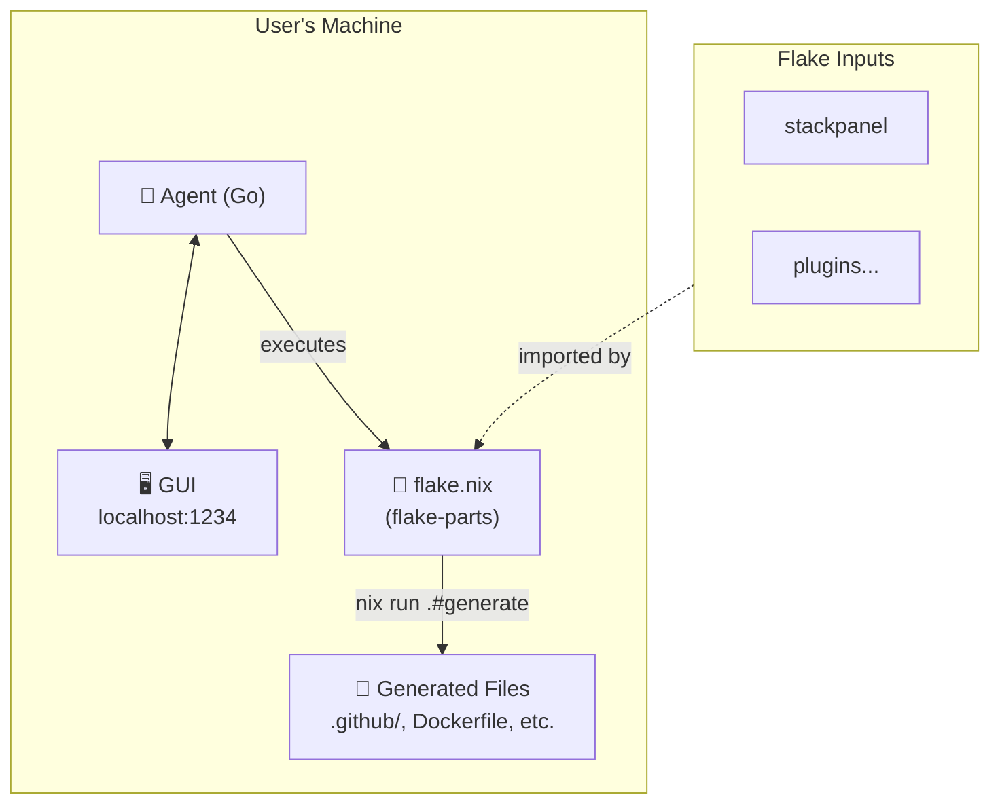

<center>
<h1>stackpanel</h1>

Your stack, one panel

</center>

Internal control plane to that lets you go from `localhost:3000` -> production without leaving the page. [^1]

For now, this document describes the architecture and implementation plan.

## Goals

- Autogenerate a reproducible dev environment for any project
  - Zero setup for popular stacks
- The default configuration is deliberately opinionated but is easy to change
- Minimal lock-in
- Open source and self-hosted.

## Architecture



**Components:**

| Component           | Role                                                                          |
| ------------------- | ----------------------------------------------------------------------------- |
| **Agent**           | Go binary serving GUI locally. Executes Nix commands. Works offline.          |
| **GUI**             | Browser interface to configure stack, trigger builds, view status.            |
| **Flake**           | Source of truth. flake-parts modules define the entire stack.                 |
| **Generated Files** | Standard paths (`.github/`, `Dockerfile`). Git-tracked. CI works without Nix. |

**Plugin ecosystem:**

```nix
inputs = {
  stackpanel.url = "github:darkmatter/stackpanel";

  # Community plugins are just flake inputs
  stackpanel-aws.url = "github:someone/stackpanel-aws";
  stackpanel-stripe.url = "github:someone/stackpanel-stripe";
};

imports = [
  inputs.stackpanel.flakeModules.default
  inputs.stackpanel-aws.flakeModules.default
];
```

## How it Works

**Nix Foundation**

stackpanel is entirely made possible by Nix which does the heavy lifting. One big reason is that nix ensures all builds start in the same zero state on all machines. Combined with the determinstic build system, we can get reproducible builds.

We are used to this reproducibilty only extending to our Docker containers, so we stop there. We can't involve regular apps in `/Applications`, our system keychain, our network interfaces, and all the other things that are hidden and untouchable by code inside docker without extra steps or workarounds.

**Modules**

Another **key** aspect is the module system of nix flakes. Programs have rules like `package.json` having to be in a specifc place, or blessed files such as `/etc/hosts`, or having to configure multiple files to get something to do what you want.

Nix's builtins and standard libraries make it very easy to do the same things using a single file. And since we can import, we can put these files anywhere we want. This makes it work very well for composing configurations, something that typically has a lot of footguns.

These are the levers we will pull to make this work. Below are more detailed plans for each module.

## Codebase

At a high-level, the user's project will look like this:

```
my-project/
├── flake.nix                 # Nix flake entrypoint (uses flake-parts)
├── flake.lock                # Locked dependencies
├── .envrc                    # direnv integration (auto-activates env)
│
├── modules/                  # User's local flake-parts modules
│   ├── default.nix           # Module entrypoint
│   └── ...                   # Custom overrides (optional)
│
├── secrets/                  # Encrypted secrets (agenix)
│   ├── secrets.nix           # Secret declarations
│   └── *.age                 # Encrypted secret files
│
│── # ─── Generated files (checked into git) ───────────────
│
├── .github/                  # Generated: GitHub Actions workflows
│   └── workflows/
│       └── ci.yml
├── Dockerfile                # Generated: Container build
├── docker-compose.yml        # Generated: Local services
├── .tool-versions            # Generated: asdf/mise version pinning
│
│── # ─────────────────────────────────────────────────────
│
├── .stackpanel/              # Agent state (gitignored)
│   └── cache/
│
└── <user-code>/              # User's actual application code
    └── ...
```

**Key insight:** Files like `Dockerfile`, `.github/workflows/`, etc. are _generated_ by Nix but placed in standard locations where tools expect them. They're checked into git for visibility and auditability. The flake overwrites them on regeneration. This reduces lock-in to near zero, since files will be exactly where tools expect them. However, it is still recommended to avoid configuration files entirely and instead bake it into the executable.

```yaml
# ⚠️ Generated by stackpanel - edits will be overwritten
# To customize, modify flake.nix and run: stackpanel generate
```

## Implemenation Details

\appendix

# Appendix

<!-- REFERENCES -->

[^1]: Can be taken further and go from _joins team_ -> production
