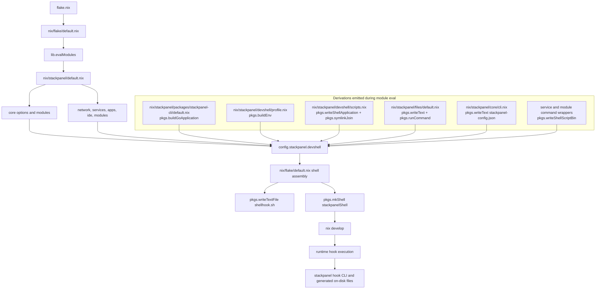

# Dependency Graph

This page maps the "what derives what" relationships in Stackpanel, with a focus on where real derivations are created vs where runtime shell scripts are executed.

## One-line model

`stackpanel config -> module evaluation -> derivation graph -> mkShell -> runtime shell hooks`

The important distinction:

- Derivation-time: `pkgs.buildGoApplication`, `pkgs.buildEnv`, `pkgs.writeText`, `pkgs.runCommand`, `pkgs.writeShellScriptBin`, `pkgs.symlinkJoin`, `pkgs.mkShell`
- Runtime shell-time: snippets in `stackpanel.devshell.hooks.{before,main,after}` and commands executed by generated binaries

## Evaluation and build graph

## Key dependency roots

- `flake.nix` is the root entrypoint and calls `nix/flake/default.nix` per system.
- `nix/flake/default.nix` is the shell builder and evaluation orchestrator:
  - loads `.stackpanel/_internal.nix` or `.stackpanel/config.nix`
  - evaluates `../stackpanel` via `lib.evalModules`
  - creates `stackpanelShell` using `pkgs.mkShell`
- `nix/stackpanel/default.nix` is the adapter-agnostic module aggregator. It imports `core`, `devshell`, `network`, `services`, `modules`, and other subsystems.

## What is actually a derivation here

- `nix/stackpanel/packages/stackpanel-cli/default.nix`
  - builds the Go CLI with `pkgs.buildGoApplication`
- `nix/stackpanel/devshell/profile.nix`
  - merges all devshell packages into one profile with `pkgs.buildEnv`
- `nix/stackpanel/devshell/scripts.nix`
  - each script is a derivation via `pkgs.writeShellApplication`
  - script package bundle is a derivation via `pkgs.symlinkJoin`
- `nix/stackpanel/files/default.nix`
  - each managed text/json file content is represented as a store path derivation
  - JSON formatting uses `pkgs.runCommand`
- `nix/flake/default.nix`
  - shell hook file is a derivation via `pkgs.writeTextFile`
  - final dev shell is a derivation via `pkgs.mkShell`

## Where imperative behavior still happens

Imperative behavior is mostly deferred to shell runtime, even when inputs are derivation-backed:

- shell hooks execute during `nix develop` shell entry
- `core/cli.nix` runs `stackpanel hook` at shell entry
- `files/default.nix` writes/syncs managed files at shell entry (using store paths as source of truth)
- service lifecycle commands (Caddy, process-compose helpers, deploy wrappers) are generated as derivations but executed imperatively

This is a good pattern: derivations produce immutable artifacts; runtime scripts perform workspace mutation and process control.

## Practical plan: more derivations, fewer ad-hoc scripts

Use this decision rule for every new feature:

1. If output is deterministic from Nix inputs, build it as a derivation first.
2. If it must mutate the repo or local state, keep the mutation in runtime hooks/scripts, but source from a derivation.
3. Keep runtime hooks thin: mostly orchestration and `cp/ln` from store paths.

### Migration checklist

- Replace inline shell chunks that generate static content with `pkgs.writeText` or `pkgs.writeTextFile`
- Replace ad-hoc command wrappers with `pkgs.writeShellApplication` (declared `runtimeInputs`)
- Aggregate executable collections with `pkgs.symlinkJoin` or `pkgs.buildEnv`
- Keep `hooks.*` focused on side effects only (linking, writing state, starting processes)
- Add a "derivation ownership" comment block at module top:
  - "Derivations produced"
  - "Runtime effects"

### Suggested refactor order

1. **High leverage**: centralize generation of command wrappers in shared helpers (`lib/scripts`)
2. **Medium leverage**: move repeated hook-generated static files into `stackpanel.files.entries`
3. **Hardening**: add checks that fail when new modules introduce large inline hooks that could be derivations

## Reading map (quick)

- Root shell assembly: `nix/flake/default.nix`
- Module graph root: `nix/stackpanel/default.nix`
- Core options root: `nix/stackpanel/core/options/default.nix`
- Devshell package/profile graph: `nix/stackpanel/devshell/core.nix`, `nix/stackpanel/devshell/profile.nix`, `nix/stackpanel/devshell/scripts.nix`
- File materialization graph: `nix/stackpanel/files/default.nix`
- Services to commands graph: `nix/stackpanel/services/global-services.nix`
- CLI derivation root: `nix/stackpanel/packages/stackpanel-cli/default.nix`
